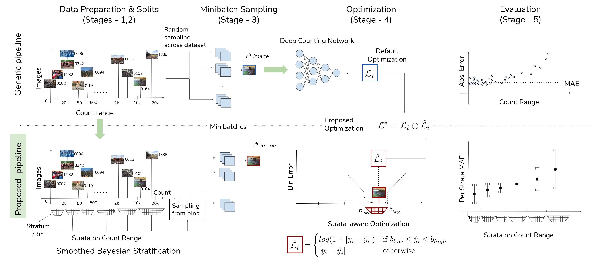
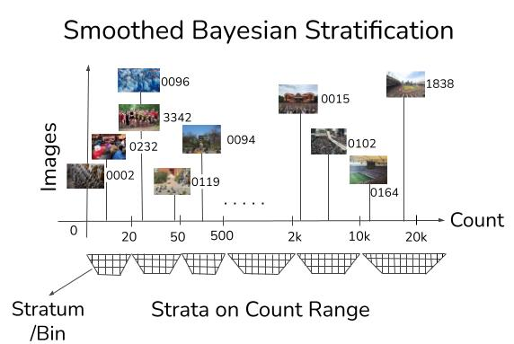
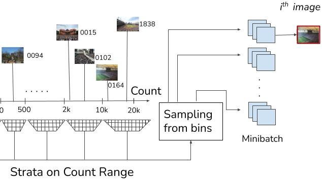
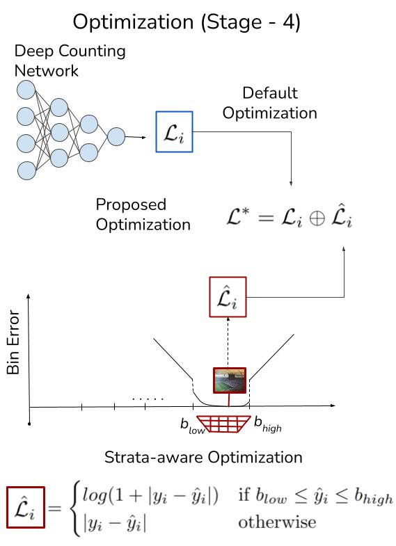
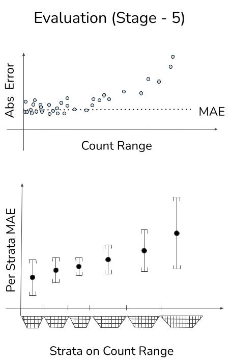

# Wisdom of (Binned) Crowds
<!-- Add the arvix and conference paper link here once available-->

### Official Implementation of ACMMM'21 paper "Wisdom of (Binned) Crowds: A Bayesian Stratification Paradigm for Crowd Counting"

## Overview Diagram

 

## Step 1 : Data Preparation & Splits (Stages(1,2)) / Binning 




### How to find bins for new dataset

In our paradigm the first step is to create strata over the count range to enable balanced data splits.
We recommend to divide the entire range of counts into strata which are optimal in Bayesian sense, and later sample images that belong to these strata. The procedure for data split generation is provided in the folder named [```binning```](binning).


<br />

## Step 2 : Minibatch Sampling (Stage 3) 



### How to sample the minibatch from bins
Next step in our paradigm is to sample from these bins. We exeprimented with two differnt ways of choosing the bin, they are :

```
    1. Round Robin sampling
    2. Random sampling
```

For a simple visualisation of the procedure you can refer to the folder named [```sampling```](sampling). In the same folder, we present a demo on how to include the sampling into any general procedure.

<br />

## Step 3 : Optimization (Stage 4) 



### How to include strata aware optimisation in your model

To reduce variance, we adopt a strata-aware optimization. A pyTorch implementation of that optimization is provided in this folder named [```optimization```](optimization).

<br />
<br />
<br />
<br />
<br />
<br />
<br />
<br />
<br />
<br />
<br />
<br />
<br />
<br />
<br />

## Step 4 : Evaluation (Stage-5) 



### How to evaluate your networks performance at a bin level 

<!-- Add a notebook that takes the model and architecture loads it returns the mean and std and if a dataset name and its bins are provided generates the bin level plots (like our website) and plots that shows its performance sample wise across the count range. -->

We evaluate the performance at a strata-level (mean and std) and a pooled mean and std. The folder [```evaluation```](evaluation) consists of a notebook to do the same. 


<br />
<br />
<br />
<br />
<br />
<br />
<br />
<br />
<br />
<br />

<!-- Add the citation here once available -->
Cite us:
```
@inproceedings{10.1145/3474085.3475522,
author = {Sravya Vardhani Shivapuja, Mansi Pradeep Khamkar, Divij Bajaj, Ganesh Ramakrishnan, Ravi Kiran Sarvadevabhatla},
title = {Wisdom of (Binned) Crowds: A Bayesian Stratification Paradigm
for Crowd Counting
},
booktitle = {Proceedings of the 2021 ACM Conference on Multimedia},
year = {2021},
location = {Virtual Event, China},
publisher = {ACM},
address = {China},
}

```
