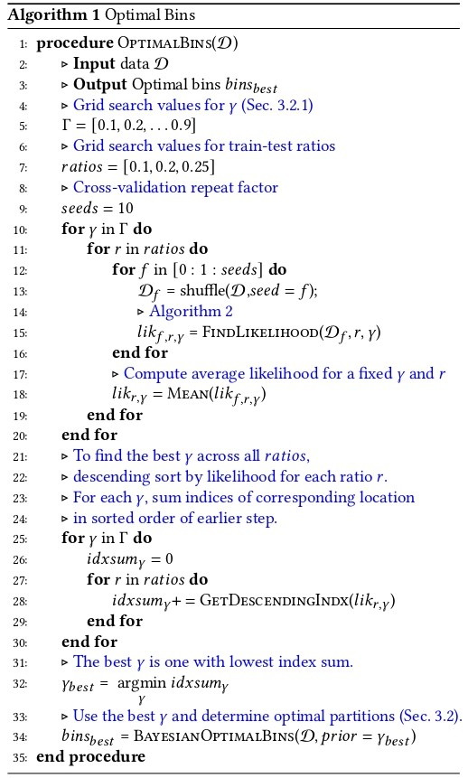
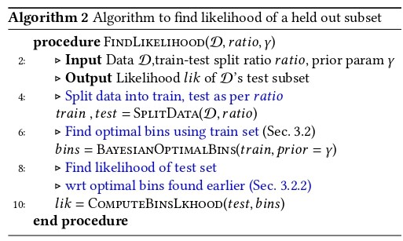

# 3.2 Revisiting Stage 2 (Creating Data splits) -- Sec 3.2

This folder contains the method in which the data-splits are created. This procedure partions the count range into balanced strata (bins) using Bayesian optimality criterion (Sec 3). The procedure can be summarised as shown below.

Alorithm Block 1 |  Algorithm block 2
:-------------------------:|:-------------------------:
 | 


## Procedure for generating bins:
### Step 1

First put your dataset txt in form of ```image_name,image_count``` in a ```.txt```. As an example we have provided the txt files for NWPU dataset.

### Step 2
To start the training run

   ```
   python train.py -d ./dataset_txt/Train_nwpu.txt
   ``` 

If you want to get bins on your dataset, change the -d argument to that path itself.

### Step 3

After training (Step 2) there are best files generated in the ```select_best``` folder. To print out the top two best binning configurations, run the fowllowing code

```
python generate_bins.py
```


The folder structure of the codes in this folder is:
```
.
├── dataset_txt             # All files of dataset are in this folder.
│   ├── *.txt               # Dataset-wise txts should be added here from ".\datasets\". 
│   └── ...
├── select_best             # After running the train.py file the best configs are stored in this (dataset-split-wise).
├── test_jsons              # While running the files generated are stored in here.
├── train_jsons             # While running the files generated are stored in here.
├── bayesian_blocks.py      # Modified version of bayesian blocks to fit our use case.
├── generate_bins.py        # This file is used to generate bins after training is over.
├── load_data.py            # For loading data
├── multinomial.py          # For multinomal distribution
├── poisson.py              # For poisson distribution
├── seeds_10.txt            # Fixing the seeds of the data splits.
├── select_best.py          # script that selects the best bin and is called in generate_bins.py
└── train.py                # For generating the bins split wise.
```